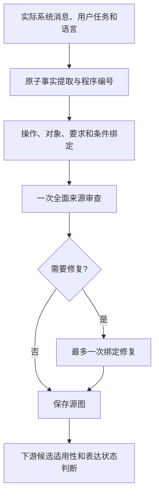

# TSG 构建审查精简：配对对照与完整流程复核

本轮检验的问题是：在同一份原始输入和构图草稿上，第二路独立关系审查能否改善最终 TSG，是否值得作为固定环节保留。

当前结论支持将一次全面来源审查作为默认方案，并保留最多一次绑定修复。源图构建与候选适用性判断已分离。证据限于已暴露的开发材料，不代表未见任务上的总体准确率或独立资格认证。

## 配对设计与结果

[冻结方案](../../data/method/open-tsg-scope-development-v1/review-ablation-six/inputs/plan.json)包含三个自然任务和三个合成控制题。每题新生成一次节点清单、关系草稿和全面审查，两条路线复用这三份完全相同的输入/输出。双路条件额外进行独立关系重建，两条路线各自最多修复一次，并分别进行新的候选范围判断。条件执行顺序按题交替。

模型、提示、来源、词表和采样设置一致。所有输出和失败保留。此处的“独立”限制审查输入，不表示换用了独立模型或外部评审。

| 指标 | 单路审查 | 双路审查 |
|---|---:|---:|
| 源图通过原文核验 | 6/6 | 6/6 |
| 图的参考检查 | 175/175 | 175/175 |
| 包括范围状态的参考检查 | 195/195 | 195/195 |
| 独立运行等价调用量 | 27 | 33 |
| 独立运行等价保守费用 | 6.678084 元 | 7.627164 元 |

六对源图逐份完全相同，六对下游范围请求也完全相同。第二路审查没有改变任何最终源图。单路少 6 次调用，减少约 18.2%；本次等价费用减少约 12.4%。

等价费用将共同前缀计入每条独立路线。实际配对实验只支付一次共同前缀，共 **41 次调用、9.296040 元**，不能把两列费用相加当成本轮实际支出。[结果及费用](../../data/method/open-tsg-scope-development-v1/review-ablation-six/analysis/summary.json)

温度题和双查询题的两条路线均进行了绑定修复，最终得到相同源图。温度题第二路审查仍将 `grib_file` 误判为确定的 SQL 数据值；最终修复依据全面审查保留了 `input_unspecified`。第二路审查在这里没有提供额外纠正。

## 范围判断的分歧及评价边界

safe/raw 条件题的两条路线获得相同源图、相同范围请求，却在新的范围调用中产生不同类型判断。单路保留原始输入 `x` 的类型未知；双路从“拼接 x 构造 SQL 文本”推断 raw 模式的 `x` 为字符序列，并进一步给出一个额外的长度要求状态。

该推断尚未获来源核验确认：原始输入的类型与其用于构造 SQL 文本时的表示需要区分。核验没有把该额外范围状态认定为已证实的错误，也没有认证它正确。主记录将其保留为 `UNCERTAIN`。因此，连同所有额外范围断言的完整验收为单路 6/6、双路 5/6；这不是图构建质量的差异，也不能归因于是否进行了第二路图审查。

此处存在来源解释边界，因此另行检查了敏感性：即使将该争议推断视为可接受，双路完整验收变为 6/6，两条路线的可用参考范围同为 13 个，仍然选择成本更低、源图相同的单路方案。该检查不改写主判定或任何旧运行结果。[选择与敏感性记录](../../data/method/open-tsg-scope-development-v1/review-ablation-six/selection/decision.json)

这也解释了为什么必须分开评价两件事：图是否正确表达了原文，以及某个候选要求能否适用于特定对象。增加图审查轮数，不能自动解决后一个问题。

## 当前实现

节点清单若未通过机械校验，仍允许一次清单修复。要求的原子化、条件、阈值及目标对象保留在构图职责内；下游不会拆分或修改源节点。候选范围判断失败时保留已完成源图，并记录失败与未知。

当前入口为 [run_tsg_development.py](../../scripts/run_tsg_development.py)。语义逻辑仍位于 [prompt_contract_extract.py](../../src/prompt_mechanism_study/prompt_contract_extract.py)，由 `_attempt_source_graph` 构建图，再由 `_assess_candidate_scopes` 判断候选状态；原入口 `_attempt_task_contract` 顺序调用两者。默认单路通常每题 4 次模型调用，包括下游范围判断；加上两处各一次修复，上限为 6 次。

旧试验分支从当前运行脚本移除，冻结执行包保留原始代码。README、审阅指南和[当前流程说明](../tsg-workflow-stability.md)已集中指向当前方法，不再将历次尝试并列为当前流程。维护中的默认测试仍为 110 项，本轮未增加测试数量。

## 完整单路流程复核

[后续冻结方案](../../data/method/open-tsg-scope-development-v1/single-review-fresh-six/inputs/plan.json)对同六题使用全新的模型响应，最多 36 次调用、15 元。它检查所选流程的完整组合，不能替代未见自然任务验证，也不计为已经完成全部稳定性重复。

**状态：已完成并封存。** 六题均通过源图与全部最终断言的原文核验，图参考检查 175/175、包括候选范围的检查 195/195，通过的可用参考范围共 13 个。没有发现错误的确定性范围状态。核验由开发作者完成，不属于外部独立认证。

| 任务 | 图参考检查 | 包括范围的参考检查 | 模型调用 |
|---|---:|---:|---:|
| 密码查询与比较 | 21/21 | 22/22 | 4 |
| PDF 上传、保存、路径存储与下载 | 24/24 | 25/25 | 4 |
| 温度查询 | 44/44 | 51/51 | 5 |
| 双查询与局部参数绑定 | 26/26 | 30/30 | 4 |
| safe/raw 条件要求 | 37/37 | 40/40 | 4 |
| 外部请求下的两个原子要求 | 23/23 | 27/27 | 4 |

仅温度题进行了一次绑定修复。最终图保留六个独立字段、连接和查询共用的 MySQL 资源关系，以及 `grib_file` 的未知输入角色。条件题保留原始 `x` 的类型未知；原子要求题分别保留参数绑定、最多 10 个字符及共同的外部请求条件。

完整复核共 **25 次调用、6.215400 元**，实际请求和响应未复用配对实验数据。25 份实际 HTTP 请求、原始响应及六份最终结果均已离线精确重放。[封存结果](../../data/method/open-tsg-scope-development-v1/single-review-fresh-six/analysis/summary.json)

两批实际合计 **66 次调用、15.511440 元**。按用户本次授权的剩余总额 50 元计，保守计费余额为 **34.488560 元**；没有与此前余额叠加。费用按返回用量、不计缓存折扣计算，不是供应商账单余额。[费用与授权记录](../../data/method/qwen37flash-prospective-qual-dev-execution-ledger-v1.json)

本轮据此结束付费调用。下一步应冻结所选流程，按现有预设规则完成稳定性重复和未用于调试的自然任务验证；这两项尚未执行，现有六题结果不足以声称一般准确率。候选适用性的类型解释仍是单独的未决边界，不能通过增加图审查轮数替代验证。

## 核验与复现

- 重构后逐项复现了此前六题的原图及最终状态。服务器干净运行环境通过 19 项相关测试；其余未改动组件复用已有验证。
- 配对实验的 41 份实际 HTTP 请求、原始响应和全部 12 份结果已用冻结代码精确重放。
- 迁移后的正式脚本同样重放了上述 41 份请求及全部结果；路径和函数命名调整没有改变模型消息或语义输出。
- 输入、模型设置、方案与来源参考在各批 `inputs/`；请求与响应在 `server-results/comparison/calls/`；逐项来源判定、费用与重放记录在 `analysis/`。
- 各批 `execution-source.tar.gz` 保留实际执行代码，`results.tar.gz` 保留原始结果。旧批次应使用自身冻结代码，不用新方法重新解释旧结果。

本轮范围是开发验证，正式协议仍为 `SPECIFIED_DRAFT`。未使用保护评估任务、未启动正式 Discovery/Confirmation，现有稳定性和迁移验证要求没有被降低。
