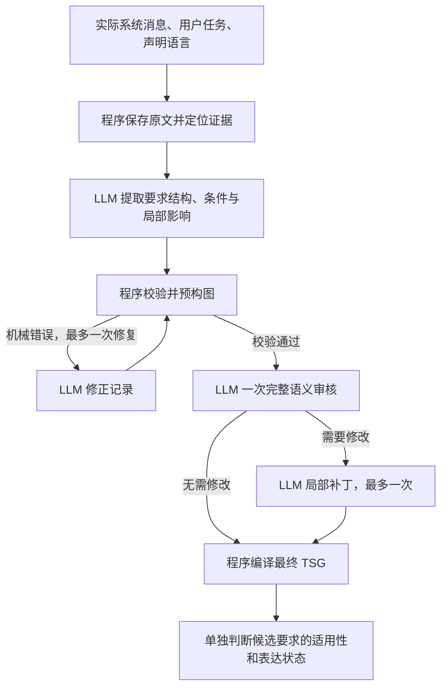

# 当前 TSG 方法与问题总结

截至 2026 年 9 月 16 日。本文件是便于讨论和交接的中文摘要，不新增方法路径；规范仍以 [研究协议](protocol.md) 和 [当前 TSG 流程](tsg-workflow-stability.md) 为准。

最新[跨任务检测对照](experiments/2026-09-16-tsg-binding-coverage-transfer.md)已完成：股票与文件任务的八个结构版本共 16 次审核，无修复。完整绑定／覆盖审核检测四个明确错误中的 3 个，普通审核检测 2 个；两者都漏掉文件任务的失败条件删除。三个参考明确的正确／等价版本均保留，另一个合取容器的目标语义参考待定，不计作模型误报或新增检测成绩。新审核未满足预定门槛，默认恢复普通来源审核，停止本轮提示改写；程序回译和保留已审核来源影响范围的规则继续保留。本轮 3.484452 元，授权账本剩余 6.977891 元。110 项检查在调用前通过，恢复默认后 29 项相关检查通过，测试数未增加。此前[图书逐项审核](experiments/2026-09-16-tsg-binding-checks.md)的局部收益及所有旧结果保持原解释。

**当前模式是：LLM 提取带证据、组合结构、条件和影响范围的语义记录，程序校验和构图，LLM 做一次普通来源审核并按需局部修复，之后单独判断候选适用范围。详细绑定审核作为未获默认采用的开发实验归档。自然语义稳定性仍未证实，下一科学决策转向自动图与人工审定图的候选发现价值比较。**

## 1. 研究目标与当前所在阶段

研究希望回答：对代码生成提示中的某项要求进行明确干预，会怎样改变生成代码的安全性和功能表现，并据此形成有适用范围的指导。

完整方法保持七步：

```text
表示 → 优先级选择 → 假设冻结 → 干预与随机化 → 测量 → 结果组装 → 推断与报告
```

目前主要阻碍位于第一步的 Prompt TSG 构建。TSG 表示原始提示中的对象、操作、要求、条件及其语义关系，边不代表因果关系。生成代码的安全性和功能性需要后续独立测量；提示没有表达某项保护，不等于生成代码缺少该保护。

协议仍为 `SPECIFIED_DRAFT`。本轮属于已暴露材料上的开发验证，未开展可支持正式研究结论的实验。

## 2. 当前构建流程



修复次数达到上限仍失败时，保留失败结果，停止该任务的后续判断。流程不通过无限重试换取成功。

各步骤的职责如下：

| 步骤 | 当前做法与边界 |
|---|---|
| 原始输入 | 程序整理真实系统消息、任务和语言，并自动定位原文证据。用户不需要提前制作编号文件。后续生成必须对应同一份输入。 |
| 语义抽取 | 对象单独声明；操作附带输入、输出、角色及执行条件；每项要求保存完整谓词、对象、范围和条件。可靠原子和合取／替代／复合否定／未解析结构在此确定，下游不再拆分自然语言。 |
| 要求性质 | 区分义务、输入假设和未确定含义。“预期输入只含字母数字”不能自动变成“必须拒绝其他字符”。假设不能作为可编辑要求或要求已表达的证据。 |
| 范围与条件 | 区分全任务运行时范围、指定对象／操作范围、代码实现层面的要求。分支条件约束相应要求；独立非执行条件使用 context_for，不能伪造操作执行条件。 |
| 程序校验 | 检查结构、引用、原文证据、层级和范围的一致性；一次反馈已检出的独立错误。开放开发中的新概念按完整定义和节点类型分配身份，避免临时名称碰撞。 |
| 语义审核与修复 | 一次审核检查全部记录及原文覆盖；必要时修正受影响记录及其依赖。程序保留范围外的记录，不再安排第二个审核者。 |
| 程序构图 | 按记录中的明确引用生成关系，取消独立的自由连边调用。程序可以保证按声明编译，不能保证声明符合原文。 |
| 候选范围判断 | 不同安全要求有各自的适用前提。例如 SQL 参数绑定需要 SQL 上下文，不能只凭“数据库操作＋数据输入角色”推出适用。不确定前提保留未知，不能偷换成不存在。 |

常规路径使用 **3 次模型调用**：抽取、审核、范围判断；加上一次机械修复和一次语义补丁，最多 **5 次**。失败或来源含义不完整时可能提前结束。

## 3. 修订前四批实际结果（保留原评分）

修订前四批使用 `qwen3.7-max-2026-05-20`，围绕股票下单、图书查询、文件消息这三个已经暴露的任务做小范围验证。

| 开发版本 | 任务运行数 | 完成构图 | 完整语义验收通过 | 实际调用数 |
|---|---:|---:|---:|---:|
| 原子记录初版 | 3 | 0 | 0 | 6 |
| 修正输出与校验接口 | 3 | 2 | 0 | 9 |
| 修正概念身份分配 | 1 | 1 | 0 | 4 |
| 补齐审核所需语义定义 | 1 | 0 | 0 | 2 |

这些是不同版本在三个任务上的重复开发运行，不能合并成八个独立样本的准确率。构图成功仅表示程序接受了结构，不表示图的含义正确。

共 **21 次真实调用，消耗 5.752776 元**；当时账本剩余授权预算为 **15.005399 元**，不是已核实的服务商账户余额。原始请求、响应和失败结果均已保留，使用各次归档实现完成了离线重放。

已有全套 110 项检查此前通过；最终修改的 45 项相关检查通过，未增加测试数量。最后的诊断修正仅进行了离线验证。补齐审核定义后的最后一个真实样例在机械校验处失败，尚未进入审核，因此不能据此评价新版审核是否有效。

## 4. 四批暴露的问题与修订依据

| 问题 | 已观察到的表现 | 当前判断 |
|---|---|---|
| 原子化不稳定 | 三项变量命名要求被合成一个节点；“存在则返回记录，否则返回 None”仍被放入同一要求。 | 完整复述一句原文，不等于形成可独立干预的原子要求。 |
| 参与关系缺少依据 | 原文提到用户名，图却进一步断言数据库插入使用用户名。 | 模型仍可能把常见业务实现当作原文明示关系。 |
| 条件与范围错位 | 返回值格式被施加到无关操作；“记录存在”限制整个返回操作；异常条件只留在文字里。 | 图可以结构合法，但扩大、缩小或丢失原意，影响后续干预。 |
| 审核漏检 | 有问题的记录仍被模型全部判为支持。 | 一次模型审核不能充当独立真值；此前审核还缺少完整角色和范围定义，不能只归因于模型能力。 |
| 机械修复反馈不完整 | 最后样例同时有已知概念定义冲突和范围错误，校验提前退出，只反馈了前者。 | 已修复诊断器，并在保留响应上确认能同时检出两类问题；模型是否能据此修好尚未验证。 |
| 局部修复仍有局限 | 较长原文片段可能让依赖闭包覆盖较多记录；精确比较不能证明改写后的语义等价。 | 程序可限制修改范围和部分错误回流，无法替代语义判断。 |
| 可用范围过于保守 | 一处来源含义未解决，当前实现可能阻断整个任务的范围判断。 | 避免了把缺边当作无关，但损失可用结果；新实现已贯通来源影响与局部评分；自然任务的稳定收益仍待证据。 |
| 参考标准存在争议 | 股票样例的时间顺序参考可能强于原文；输入预期和拒绝义务需要分开。 | 参考本身也需要审核，不能把所有不匹配都算成模型错误，也不能事后改分美化结果。 |

这些失败包含两个不同层面：一是结构、引用、层级等一致性错误使程序拒绝构图；二是已经构成的图存在语义错误。尤其最后一个样例的两次响应都是合法 JSON，失败并非 JSON 语法无法解析。

## 5. 核心判断与尚待验证的内容

问题不能简化为“模型能力不足”。已有证据同时指向：**语义抽取仍不可靠、表示规则容易被误用、审核上下文曾不完整、机械诊断曾漏掉独立错误**。程序已修复其中一些可确定的实现缺陷，但没有证据证明完整语义准确性因此提高。

评判时应分别报告：关键语义错误、原文要求覆盖、经过来源核查的可用范围、整图完整验收；机械失败和成本另列。允许语义等价的图结构，不把指定拓扑当作唯一答案；不能放过虚构参与关系、丢失分支或改变要求范围等会影响研究有效性的错误。

当前最明确的状态是：**流程已简化，表示职责更清楚；稳定提取完整、正确的开放语义图仍未达成。** 个别范围结论虽有来源支持，本轮仍没有获准用于干预的完整范围，不能宣称方法已稳定或某个模型更优。

在下述方法建议提出前，下一项最小验证计划针对合并诊断反馈和补齐定义后的审核。新的优先事项是先明确研究相关结构和候选判定边界，再用已暴露样例验证这些边界；不能只把整图验收继续作为唯一推进条件。第 6 节给出已实施的约定；新的有界真实运行单独报告，不重写四批旧结果。

实现与证据入口：[当前流程](tsg-workflow-stability.md)、[本轮实验报告](experiments/2026-09-16-tsg-atomic-records.md)、[下游候选构建](tsg-candidate-construction.md)、[审阅指南](reviewer-guide.md)。

## 6. 对收敛建议的代码核对与修订方向

本节记录本次修订：**表示、候选接口和开发评分已更新；正式资格标准与四批历史评分不变**。110 项离线检查通过，未增加测试数量。

具体实施顺序、修改位置、最小验证与预算边界见 [TSG 修订实施计划](tsg-revision-plan.md)。组合结构、来源局部影响、非执行条件、候选级评分及审核前后记录均已实现。真实运行结果另行冻结。

下一轮开发问题调整为：能否可靠保留研究相关要求的完整内容、对象和条件，并让相应候选判断正确且有覆盖；随后再检验结构是否改善假设发现。完整图验收继续作为诊断保留，不再是唯一的开发判断依据。正式研究的资格规则如需调整，仍须在新评估前明确修订并冻结，不能事后放行旧失败。

### 修订前的根因与此次落点

| 核对位置 | 修订前状态 | 应调整的边界 |
|---|---|---|
| `source_records.compile_records` | 原子记录编译时把所有来源片段的影响写为 `global`。 | 现有 `unit_impacts` 已能承载局部影响；局部性必须有完整原文依据，不能根据缺边或图距离推断。 |
| `prompt_contract_extract._scope_blockers` | 已支持明确声明的局部、全局和未确定影响，按操作阻断。 | 先贯通已有操作级局部性，不急于增加更细框架；同一操作内无法可靠区分的未知仍保守阻断。 |
| `prompt_contract_qualification.evaluate_open_semantic_case` | 已有 `scope_dependencies` 和分层指标，但单个范围的 `correct` 仍要求整图不存在不支持或未核查的断言。 | 局部来源检查和来源断言审查需要同时限定到该候选的完整依赖；只去掉全局条件会错误放行。无法定位的断言仍全局阻断。 |
| `candidate_construction._occurrence` / `_query` | 条件必须独立连接操作，单独约束要求的条件不能进入自动候选。 | 这是已知的下游表达限制。不能为了通过它而给原图虚构“条件限制整个操作”的边；需要明确可冻结、且不依赖目标要求状态的条件上下文。 |

因此，问题不仅是整图验收过严；条件要求的表示与候选上下文绑定也存在职责不匹配。应同时检查“正确图能否被下游使用”和“错误图是否被下游误用”。

### 表示与使用的最低约定

1. 原子要求是带对象、范围和条件的完整谓词。`C ⇒ (A ∧ B)` 可拆成两个都保留 C 的要求；`A ∨ B` 不能变成同时要求 A 和 B。
2. 保留影响研究含义的合取、替代、条件和否定范围。无法可靠分解的复合要求可以留作约束；Atomic 候选只能使用已经独立表示且意义明确的叶子。处在替代分支中的叶子不因被表示就成为必须满足的要求。
3. “语义上能分开”与“可以独立编辑”分开判断。删除或增加目标要求时，共同条件、其他分支和非目标行为必须保留；无法做到时，是该干预未获准，不自动等于整个来源任务有缺陷。
4. 未知仅在有来源证据支持完整影响范围时局部传播。全局接口、共享对象、跨操作约束以及影响范围本身未确定的内容仍可阻断多个候选或全任务。
5. 分开记录适用性、原文是否表达要求、编辑是否可行。适用不等于已表达，更不等于可干预；未提取到要求不等于已确认未表达。

上述约定已在同一条现有链路实现并通过合成边界检查；这不证明真实模型的语义抽取稳定。

### 最小验证及研究边界

- 先在已经暴露的材料上检查有条件的原子要求、替代要求、无关局部未知、相关／全局未知四类边界。缺少已暴露例子时，可以用明确标为合成的例子检查程序行为，不能把它们当作自然任务上的准确性证据。
- 来源参考同时列出应有候选和不应接纳的候选，按任务、完整要求和范围对齐。保留模型遗漏、程序失败、未知，以及参考之外新增的错误候选。不能只在成功生成的候选上统计正确率。
- 报告关键语义错误、候选接纳正确性、适用候选找回率和覆盖率；整图完整率保留。审核前后使用固定参考单位，分别记录错误→正确、正确→错误，以及进出未知的变化。审核批准不是参考真值，净收益也不能掩盖关键错误新增。
- 候选范围是可用性判断单位；独立任务单位仍是统计和因果分析单位。同一任务中的多个候选不是独立重复。局部筛选发生在分配之前，分配后的失败仍留在原分母。
- 自动 TSG、人工审定 TSG、同概念扁平表示可作为后续表征诊断：前两者比较抽取瓶颈，自动图与其扁平版本比较结构价值。任务集合、候选预算、生成预算及判据需要预先对齐；人工图不承诺更好，假设数量不等于发现价值。“有价值”的判据需预先说明，不以出现正向显著效果为唯一标准，零效应、有害和未确定结果仍保留。这组诊断不能替代协议中已有的正式 Atomic／Pair 对照。
- 先固定新规则，再使用未参与本轮修改且未被保护用途占用的表征评估材料。当前已暴露样例只能支持开发结论；没有这样的新材料时就保留泛化证据缺口，不挪用保护集。D0 的时点和选择边界不变。

规范已同步允许组合结构保留与候选级开发评估；完整任务的正式资格标准继续保留。实现沿用现有记录、影响声明和评估器，没有新增资格框架或审核轮次。

### 文献支持的范围

以下仅核对了论文页面的摘要和研究范围，未开展新的系统文献综述：

- [PICARD](https://aclanthology.org/2021.emnlp-main.779/) 研究用增量解析约束生成形式合法的输出，不构成当前 TSG 含义正确性的证据。
- [Selective Classification for Deep Neural Networks](https://papers.nips.cc/paper_files/paper/2017/hash/4a8423d5e91fda00bb7e46540e2b0cf1-Abstract.html) 支持同时考虑错误风险和覆盖率的思路；其图像分类结果不能直接赋予 TSG 同样的风险保证。
- [Large Language Models Cannot Self-Correct Reasoning Yet](https://proceedings.iclr.cc/paper_files/paper/2024/hash/8b4add8b0aa8749d80a34ca5d941c355-Abstract-Conference.html) 讨论缺少外部反馈的推理自纠错局限。它提示需要实测审核效果，不能据此直接判定本项目的一次来源审核无效或有效。
- [AMR 指标的等价性研究](https://aclanthology.org/2024.starsem-1.32/) 支持区分结构匹配和意义等价；本项目原本就允许等价表示，仍需核查具体参考是否错误排除了它们。
- [How to Make Causal Inferences Using Texts](https://arxiv.org/abs/1802.02163) 讨论学习文本表示引入的识别与过拟合风险及分样本思路；它不能替代本研究自己的样本划分和实验设计。
